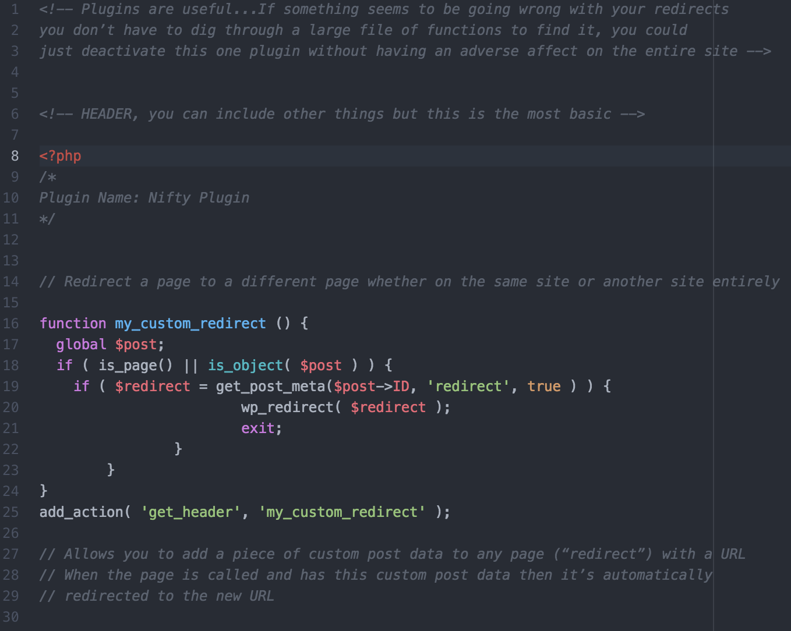

  

## Is:

- Free CMS (Content Management System) 

- You can use Wordpress.com (web template system) or a computer running the software package on WordPress.org (plugin architecture) 

- Plugins used to create features and functionality 49,394 currently available 

- Used by 27.5% of the top 10 million websites 

- The most popular blogging system in use on the web, supporting 60 million websites 

- Native applications exist for Mobile, however, they are limited mostly to the blogging side 

- PHP, HTML, CSS are the base 

- Released in 2003  

## Dependencies:

1. PHP (originally: Personal Home Page) 
2. HTML 
3. CSS  

## Use:

Why would someone use Wordpress? 
Simple Themes, Plugins, API 

Clients? 
Sony Playstation, New York Times  

## Tutorial:

MAMP  
- Stands for Macintosh, Apache, MySQL and PHP.  
- Allows you to build and test WordPress sites offline, entirely on your own computer 
- Gives you access to a local Apache server  

Components of MAMP 
- Macintosh: an operating system 
- Apache: an open source web server 
- MySQL: most widely available relational database in the world (all Wordpress sites use MySQL dbs) 
- PHP: server-side scripting language  

Set Up Steps 
1. Install the latest version of Wordpress
    * Create Sites folder
    * Create Wordpress folder - store WP zip file in this folder
2. Install MAMP on your Computer
3. LaunchMAMP from your Applications Folder
    * Must be in your Apps folder
    * Click on the MAMP folder
    * Click on the MAMP icon
    * Click Preferences
4. Set the Ports
    * Click Ports
        * Use defaults
5. Configure the Web Server and Document Root
    * Click Web Server tab
    * Make sure it's Apache
    * Set root route by clicking gray folder icon
        * Users -> Name -> sites -> Wordpress
6. Start your Servers
    * Click WebStart button
7. Create a MYSQL DB
    * Got to http://localhost:8888/phpMyAdmin
    * Name your DB and click create
8. Unzip the Wordpress Install
    * Double click the zip file
9. Configure the WP-Config.PHP File
    * Open the wp-config-sample.php file in Atom
    * Replaces db name with the db name you just created
    * Replace password and username with 'root'
    * Rename the file wp-config.php
10. The Famous Five Minute Install
    * Go to: localhost:8888/wordpressnew
        * Or whatever the name of the folder is in your root folder
        * Follow the prompts and click Install Wordpress
11. Log Into the Wordpress Dashboard Panel
    * Got to: http://localhost:8888/wordpressnew/wp-admin
        * Or whatever the name of your folder is
12. Use MAMP in the Future
    * Turn on your MAMP server
    * Visit the URL with the folder name: localhost:8888/wordpressnew
    * To login add: /my-admin
    * To create a new local WordPress site:
        * Download latest version of WP and unpack the zip file in your sites folder
        * Rename the folder to correlate with your site
        * Set up new MySQL db in phpMyAdmin
        * Configure the wp-config.php file to match new db name
        * Go through 5 min. Install

## Official Documentation:

https://developer.wordpress.org/  

## Hurdles:

-Installation of MAMP  

## Screenshots:

## Code for a PLUGIN:

## Knowledge Assumed:
- It's not just "one click and done"  

## Research:
- Server side after MAMP installation  
